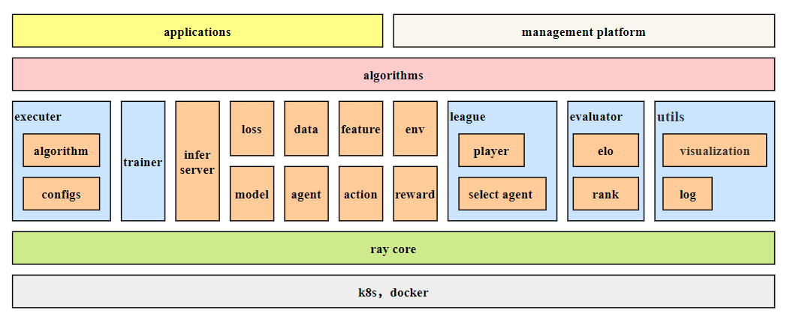
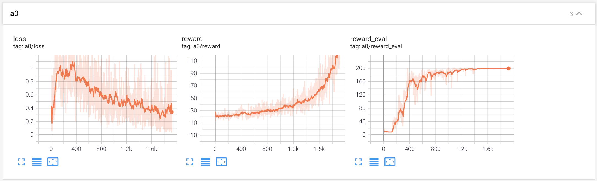

项目地址：https://github.com/CASIA-CRISE-GML/malib

文档地址：https://github.com/CASIA-CRISE-GML/MALib-Tutorial

API文档地址：http://10.1.14.128:2021/


- [介绍](#介绍)
- [快速入门](#快速入门)
    - [运行实例代码](#运行实例代码)
    - [定义算法](#定义算法)
    - [使用日志模块记录训练过程](#使用日志模块记录训练过程)
- [TODO](#todo)
- [开发者文档](#开发者文档)
    - [系统架构文档](#系统架构文档)
    - [自定义环境](#自定义环境)
    - [需求和问题收集](#需求和问题收集)
    - [开发规范](#开发规范)

## 介绍

MALIB是一个通用的博弈对抗学习平台，对强化学习算法和博弈算法进行标准化抽象定义，提供统一的功能模块接口。



**MALIB的主要特性和设计目标为：**

-   **标准的模块化抽象，提供统一的API**。环境、模型、智能体、玩家、学习器、评估器等模块均抽象成统一的标准的接口，用一套统一的接口实现单智能体、多智能体、单个玩家、多个玩家、分层/不分层决策、中心化/去中心化决策等各类不同的强化学习和博弈对抗算法。

-   **易用、高效、稳定的分布式学习平台**。针对强化学习算法和博弈算法对算力的需求，提供对分布式计算的完整支持。使用者不需要关心分布式的实现和资源管理，只需要定义算法。平台充分利用硬件资源提供高效、稳定的计算。

-   **提供丰富的可用的算法资源，可快速在新环境或对新算法进行验证**。平台内置最常用的学习环境，进行 统一的封装和个性化的定制。内置经典强化学习和博弈学习算法。提供多种算法样例，实现方便的算法定制、环境定制和算法验证。

-   **在硬件上对集群和计算资源进行统一管理和调度**。使用K8s和Docker构建计算集群硬件管理和资源调度系统。

    

## 快速入门

#### 运行实例代码

运行代码前参考[安装指导](https://github.com/CASIA-CRISE-GML/malib/blob/main/Installation.md)配置好运行环境。项目中的实例代码放在examples文件夹下，在项目根目录执行`python example/xxx.py`命令可直接运行某示例算法。

在项目根目录启动tensorboard，可在tensorboard中查看算法的训练过程和效果。

#### 定义算法

在平台上实现某种算法，至少需要进行以下步骤。以`example/dqn_cartpole_v0.py`为例。

- 通过配置参数指定整个学习过程的详细信息
- 自定义动作生成方法和特征提取方法
- 定义数据收集类型和处理方法
- 定义在数据上更新模型的方法（训练过程、loss计算等）。

1. **通过一系列参数定义整个学习过程，包括player、agent和env，player的特征计算方法、动作生成方法、数据处理方法、模型学习方法等**

   定义一个强化学习算法，至少需要定义三个过程：

   -   要指定自己的player、agent和env，实现player和env 的交互。平台中给出了一个BasePlayer和一个BaseAgent类，大多数算法可直接使用这两个类，只需要对特征和动作的方法进行定义。有些更复杂的例如分层算法需要更复杂的player和agent，用户可自定义player和agent类。
   -   指定跟数据收集有关的方法和步骤
   -   定义模型在数据上的学习方法

   MALIB通过配置模块实现对上述过程的参数定义。`dqn_cartpole_v0`中完整的配置示例：

   ```python
   
   learner_config = dict( # learner 配置：定义使用的环境，要优化的player 和agent，定义学习相关的超参数
       config_name="learner_config", # 配置名称：必须有，配置模块通过该名称对配置进行解析，后面使用该名称访问对应的配置
       game_number=game_number, # 生成数据时开多少个selfplay进程
       env_name="cartpole_v0", # 使用的环境
       player_id="p0", # 要训练和优化的player id，玩家的id只能是环境中存在的玩家的id
       learn_agent_id=["a0"], # 要训练和优化的agent id
       tb_dir="logs/tmp", # tensorboard 工作目录
       log_dir="workdirs/tmp", # 日志工作目录
       ray_mode="sync",  # ray模式，sync: ray.get, async: ray.wait
   )
   player_config = dict( # player config，给出env中所有player 的id 类别，同时指定 每个player对应哪些agent
       config_name="player_config",
       players=["p0"], # env 中所有player的id
       p0=dict(player_name="agent:BasePlayer", agents=["a0"]), # 每个player 中的agent id
   )
   
   agent_config = dict( # agent 配置，定义每个具体的agent的参数
       config_name="agent_config",
       a0=dict( # a0 agent的具体配置，a0指agent的id，必须是p0 player中的 agent id
           agent_name="agent:BaseAgent", # agent的类，目前只支持字符串，后期同时支持字符串和类对象
           model_name="model:MLP", # agent的模型类
           model_in_shape=(4), # 模型参数
           model_out_shape=(2), # 模型参数
       ),
   )
   
   action_config = dict(config_name="action_config", p0=action_function1) # 定义每个player使用的动作方法
   feature_config = dict(p0=feature_function1, config_name="feature_config") # 定义每个player 使用的特征计算方法
   
   data_config = dict( # 数据模块的参数配置
       config_name="data_config",
       data_to_save=dict( # 定义要保存哪些数据。
           player_data=["feature", "obs", "model_out", "action"], # 定义要保存哪些player有关的原始数据
           # other_data=["game_data"],
           other_data=["game_data", "reward"], # 定义要保存哪些selfplayer中的其他原始数据
           preprocessing_data=["td_reward"], # 定义自己需要进行预处理的数据，
           # preprocessing_data=[],
       ),
       train_data_num=256, # 每次拿多少个数据去训练
       tra_len=1, # 每个数据的轨迹长度。目前支持收集轨迹数据，后面会加上其它类型的数据，例如单步sars数据等
       batch_size=128, # 模型训练时的batchsize
       data_async=False, # 数据收集方式，包括同步和异步两种
       data_capacity=2000, # replayerbuffer的容量
       data_sample_mode="USWR", # 数据采样方式：目前支持先入先出和有放回随机采样两种
       process_on_episode=td_on_episode,  # 配置自定义的数据处理方法
   )
   
   trainer_config = dict( # 训练器的配置，该部分定义了怎样在给定的数据上去优化模型参数
       config_name="trainer_config",
       use_gpu=torch.cuda.is_available(), # 是否使用GPU训练
       trainer_mode="remote", # 训练器的模式：有本地模式和远程模式两种。本地模式：trainer运行在主进程。远程模式：trainer运行在独立进程
       a0=dict( # 每个agent对应一个trainer，定义trainer的各项参数
           trainer_name="trainer:DQNTrainer", #
           lr=0.001,
           target_model_update_iter=30,
           EPSILON=0.9,
           GAMMA=0.9,
           # training_procedure= train_on_batch,
       ),
   )
   ```
   
2.  **动作和特征的方法可参考`example/dqn_cartpole_v0.py`中的方式进行定义。**

    动作和特征方法需要注意返回的数据的格式是固定的，

    -   特征处理方法输入为环境的state，返回一个字典格式的数据，字典的键为player每个agent id，每个键对应的是每个agent的特征或者方法。
    -   动作生成方法输入为一个字典格式数据，字典键为agent id，值为每个agent的模型的前向结果。返回环境规定的动作信息。

    ```python
    def action_function1(player, model_out):
        if player.total_step_num == 0:
            player.epsilon = 1.0
            player.episode_count = 100000
        if not player.training:
            prob = torch.nn.Softmax(dim=-1)(model_out["a0"])
            action_index = torch.argmax(prob)
            # action_index = torch.multinomial(prob, num_samples=1)
            action = action_index.item()
        else:
            if np.random.rand() < player.epsilon:
                action = np.random.randint(0, 2)
            else:
                prob = torch.nn.Softmax(dim=-1)(model_out["a0"])
                action_index = torch.argmax(prob)
                # action_index = torch.multinomial(prob, num_samples=1)
                action = action_index.item()
        if player.training:
            player.epsilon -= 1.0 / player.episode_count
            player.epsilon = max(0.01, player.epsilon)
    
        action_dict = {}
        action_dict["a0"] = action
        return action, action_dict
    
    
    def feature_function1(state):
        f = {}
        fea = torch.tensor(state).float()
        f["a0"] = fea
        return f
    
    ```

3. **定义数据收集类型和预处理方法（可选）**

    用户可自定义需要保留哪些selfplay中的原始数据，selfplay只负责生成和保存原始数据，任何需要进一步计算得到的数据用户需要自定义数据预处理方法。以`example/dqn_cartpole_v0.py`中的为例。

    -   **原始数据**：selfplay中的原始信息是有限的，MALIB把所有原始信息对应到固定的名字。用户在player_data和other_data中罗列需要的原始数据。
    -   **预处理数据**：当用户需要自定义预处理的数据时，需要进行两个步骤：
        -   在preprocessing_data中告诉MALIB用户自定义数据的名字，注意不要和原始数据名字重复
        -   用process_on_episode告诉MALIB用户的方法，同时实现这个方法。

    ```python
    data_config = dict(
        config_name="data_config",
        data_to_save=dict(
            player_data=["feature", "obs", "model_out", "action"],
            other_data=["game_data", "reward"],
            preprocessing_data=["td_reward"],
        ),
        process_on_episode=td_on_episode,  # 配置自定义的数据处理方法
    )
    
    # 用户自定义数据预处理方法，该方法接受一个episode的用户指定的所有原始数据
    # 需要返回固定格式的预处理的数据
    def td_on_episode(storage, episode_data): 
        data_return = {}
    
        for a_name, a_d in episode_data.items():
            data = {}
            # data_name = "reward"
            data_name = "td_reward"
            reward = list(a_d["reward"])
            for j in range(len(reward) - 2, -1, -1):
                reward[j] = reward[j] + 0.9 * reward[j + 1]
            data[data_name] = reward
            data_return[a_name] = data
        return data_return
    
    ```

4. **定义模型在数据上的更新方法**

   算法的核心部分是模型在数据上的参数更新过程。每个不同的强化学习算法，最核心的部分和差异就是模型怎样利用数据去更新参数。不同的算法很难用一个或数个公共的接口全部兼容到。MALIB中这部分的代码放在trainer文件中。对于现有的典型的有代表性的强化学习算法，每个算法用一个独立的trainer文件去实现。用户自定义算法的这部分内容时：

   -   如果是全新的算法，或者trainer模块下没有类似的算法，可独立写一个trainer文件，加入到MALIB算法集合中。
   -   大多数情况下，用户需要自定义的算法是对已有强化学习算法的改进和创新。这种情况下，用户不需要自己去定义trainer文件，需要进行两个步骤：
       -   在trainer_config中定义training_procedure= train_on_batch设置项，告诉MALIB自己要自定义trainer中的该方法。
       -   实现该方法，该方法会替换trainer中的_train_on_batch方法。

   ```python
   # main.py 
   def train_on_batch(self, data):
       """define the training procedure in trainer
   
       Args:
           data (Data): datas for training
   
       Returns:
           result (dict): training result
       """
       pass
   
   trainer_config = dict( # 训练器的配置，该部分定义了怎样在给定的数据上去优化模型参数
       config_name="trainer_config",
       use_gpu=torch.cuda.is_available(), # 是否使用GPU训练
       trainer_mode="remote", # 训练器的模式：有本地模式和远程模式两种。本地模式：trainer运行在主进程。远程模式：trainer运行在独立进程
       a0=dict( # 每个agent对应一个trainer，定义trainer的各项参数
           trainer_name="trainer:DQNTrainer", #
           lr=0.001,
           target_model_update_iter=30,
           EPSILON=0.9,
           GAMMA=0.9,
           training_procedure= train_on_batch,
       ),
   )
   
   # dqn_trainer.py
   def _train_on_batch(self, data):
       # self.update_target_model()
       # self.target_model_update_iter+=1
       print("DQN train on batch")
       feature_list = data.feature
       fea0 = [f[0] for f in feature_list]
       fea1 = [f[1] for f in feature_list]
       action = [a[0] for a in data.action]
       reward = [gd[0]["reward"] for gd in data.game_data]
       done = [gd[0]["done"] for gd in data.game_data]
       dataset = data.make_dataset([fea0, fea1, action, done, reward])
       loss_info = []
       for d in dataset:
           f0, f1, ac, do, re = d
           f0, f1, ac, do, re = (
               f0.to(self.device),
               f1.to(self.device),
               ac.to(self.device),
               do.to(self.device),
               re.to(self.device),
           )
           re = re.float()
           # f0,f1,do,re=f0.float(),f1.float(),do.float(),re.float()
           ac = ac.view(-1, 1)
           q_predict = self.model(f0)
           q_predict = q_predict.gather(1, ac)
           q_next = self.target_model(f1).detach()
           max_q = q_next.max(1)[0]
           n_d = do == 0
           q_next = max_q * n_d
           q_target = re + self.GAMMA * q_next
           q_target = q_target.view(-1, 1)
           loss = self.loss_func(q_predict, q_target)
           loss = loss.float()
           loss_info.append(loss.item())
           self.optimizer.zero_grad()
           loss.backward()
           self.optimizer.step()
           self.iteration_count += 1
           if self.iteration_count % self.target_model_update_iter == 0:
               self.update_target_model()
   
       result = {}
       result["loss"] = loss_info
       return result
   
   ```


#### 使用日志模块记录训练过程

   日志模块负责记录学习过程的全部信息，主要包括两个方面：

-   学习曲线

    MALIB使用tensorboard记录学习数据、绘制学习曲线，trainer自动记录训练时的损失曲线，其它需要记录的曲线用户可使用log模块提供的接口进行自定义。

    ```python
    # log.py
    def add_scalar(self, name, value_y, value_x):
        """使用tensorboard记录学习过程
    
        Args:
            name (string): 学习曲线的名字，一般格式为："name/subname"
            value_y (scalar): y value
            value_x (scalar): x value
        """
        self.writer.add_scalar(name, value_y, value_x)
        self.writer.flush()
    
    # main.py
    logger.add_scalar("a0/reward", mean_reward1, learner.learn_step_number)
    ```

    在用户指定的tensorboard工作路径启动tensorboard，即可观察训练曲线信息。

    

-   记录训练过程信息

    除了训练曲线，日志模块自动记录完整的参数信息。训练过程的其他信息log模块提供接口进行记录。

    ```python
    # log.py
    def info(self, info_list):
        """把info_list中的信息写入日志文件
    
        Args:
            info_list (lsit): 日志行信息，格式为：[a, b, c], a,b,c 可为任意类型
        """
        string_info = " ".join([str(i) for i in info_list])
        self.logger.info(string_info)
    
    # mian.py
    logger.info(
        [
            "learner step number:{},train reward:{},eval reward:{}".format(
                learner.learn_step_number, mean_reward1, mean_reward2
            )
        ]
    )
    
    ```

    日志内容示例：

    ```python
    {'action_config': {'config_name': 'action_config',
                       'p0': <function action_function1 at 0x7f04107e5b00>},
     'agent_config': {'a0': {'agent_name': 'agent:BaseAgent',
                             'model_in_shape': 4,
                             'model_name': 'model:MLP',
                             'model_out_shape': 2},
                      'config_name': 'agent_config'},
     'config_name': 'learner_config',
     'data_config': {'batch_size': 128,
                     'config_name': 'data_config',
                     'data_async': False,
                     'data_capacity': 2000,
                     'data_sample_mode': 'USWR',
                     'data_to_save': {'other_data': ['game_data', 'reward'],
                                      'player_data': ['feature',
                                                      'obs',
                                                      'model_out',
                                                      'action'],
                                      'preprocessing_data': ['td_reward']},
                     'process_on_episode': <function td_on_episode at 0x7f04107eb560>,
                     'tra_len': 1,
                     'train_data_num': 256},
     'env_name': 'cartpole_v0',
     'eval_config': {'config_name': 'eval_config',
                     'eval_game_num': 20,
                     'eval_game_number': 10,
                     'game_mode': 'remote',
                     'total_episode_number': 20},
     'feature_config': {'config_name': 'feature_config',
                        'p0': <function feature_function1 at 0x7f04107eb3b0>},
     'game_number': 15,
     'learn_agent_id': ['a0'],
     'learn_player_id': 'p0',
     'log_dir': 'workdirs/tmp',
     'model_config': {},
     'player_config': {'config_name': 'player_config',
                       'p0': {'agents': ['a0'], 'player_name': 'agent:BasePlayer'},
                       'players': ['p0']},
     'player_id': 'p0',
     'players': ['p0'],
     'ray_mode': 'sync',
     'tb_dir': 'logs/tmp',
     'trainer_config': {'a0': {'EPSILON': 0.9,
                               'GAMMA': 0.9,
                               'lr': 0.001,
                               'target_model_update_iter': 30,
                               'trainer_name': 'trainer:DQNTrainer',
                               'trainer_number': 1,
                               'training_procedure': None},
                        'config_name': 'trainer_config',
                        'trainer_mode': 'remote',
                        'use_gpu': True}}
    03-11-2021 20:23:00 - INFO - learner step number:0,train reward:17.571428571428573,eval reward:41.25
    03-11-2021 20:23:01 - INFO - learner step number:1,train reward:18.3,eval reward:41.15
    03-11-2021 20:23:01 - INFO - learner step number:2,train reward:16.454545454545453,eval reward:41.65
    03-11-2021 20:23:02 - INFO - learner step number:3,train reward:19.5,eval reward:38.95
    03-11-2021 20:23:02 - INFO - learner step number:4,train reward:21.5,eval reward:33.5
    03-11-2021 20:23:02 - INFO - learner step number:5,train reward:25.5,eval reward:42.45
    03-11-2021 20:23:03 - INFO - learner step number:6,train reward:31.8,eval reward:39.1
    03-11-2021 20:23:03 - INFO - learner step number:7,train reward:19.90909090909091,eval reward:34.75
    03-11-2021 20:23:04 - INFO - learner step number:8,train reward:21.6,eval reward:34.65
    03-11-2021 20:23:04 - INFO - learner step number:9,train reward:17.3,eval reward:38.1
    03-11-2021 20:23:04 - INFO - learner step number:10,train reward:20.4,eval reward:34.9
    03-11-2021 20:23:05 - INFO - learner step number:11,train reward:19.09090909090909,eval reward:33.3
    03-11-2021 20:23:05 - INFO - learner step number:12,train reward:19.8,eval reward:30.2
    03-11-2021 20:23:06 - INFO - learner step number:13,train reward:18.0,eval reward:36.4
    
    ```

    

   ## TODO

   -   [x] 快速入门
   -   [ ] 架构介绍和模块介绍
       -   [x] 第一版本
       -   [ ] 改进和完善架构描述
       -   [ ] 补充和改进各个模块的详细描述
   -   [x] 代码 API 文档
   -   [ ] 补充开发者文档

   

   ## 开发者文档

   #### 系统架构文档
   
   [引擎的架构和模块介绍](architecture.md)
   
   #### 自定义环境
   [环境定义和添加](environment.md)
   
   #### 需求和问题收集
   [需求、问题和建议收集](develop.md)
   
   #### 开发规范
   [git 规范](how-to-git.pdf)
   
   
   
   

