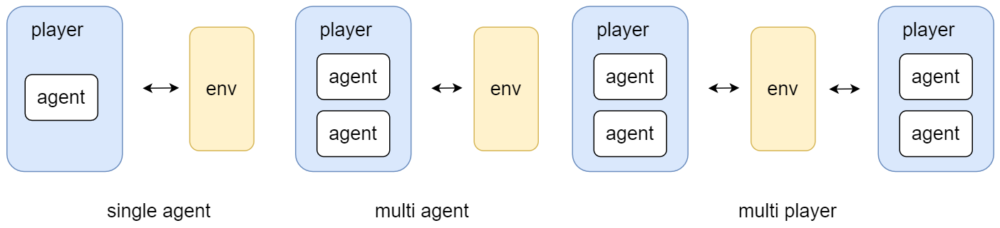
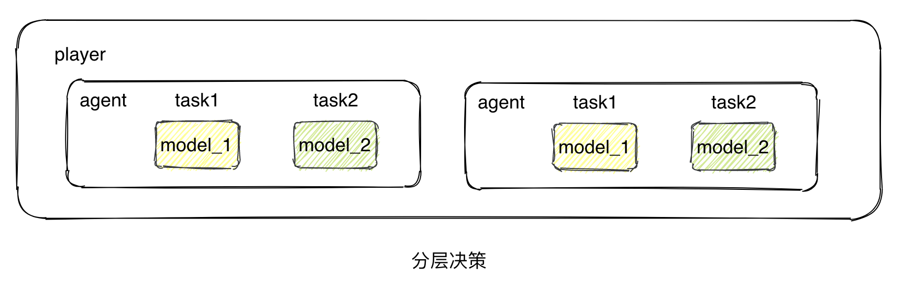
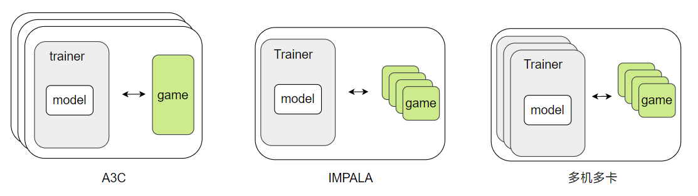

## 算法抽象

#### 博弈过程抽象：单智能体、多智能体、多玩家

将所有博弈过程抽象成玩家、环境、动作、状态的集合， $ Game=\{E, P, A, S\},$其中，$P=\{p_1,p_2,...,p_n\},$ $p_i=\{agent_1,agent_2,...,agent_m\},$ $ A=\{action_{p_1},...,action_{p_n}\}$, $S=\{state_{p_1},...,state_{p_n}\}$. agent指某种类型的智能体，例如一个小兵或多个小兵，都对应一个智能体。agent也可以指某个固定的智能体，例如两个小兵对应两个智能体。

Game代表一场博弈过程，Game统一用multi player 形式表示。一套代码可同时实现以下三种游戏形式。



#### 中心和去中心算法

中心和去中心指一个player中的多个agent是否完全用独立的policy去决策。配置文件中通过设置agent和model的对应关系实现一下三种决策方式


#### 分层算法

分层算法中每个agent中包含多个针对不同任务的模型。



#### 无环境学习算法

## 整体架构和模块设计

平台将完整的强化学习或者博弈学习算法拆分成环境、模型、智能体、玩家、训练器、评估器等模块，这些模块共同组成完整的算法，如下图所示。


将完整的算法视作一个学习过程，用Learner类实现。将所有可并行模块使用Vector包装，例如VectorGame、VectorTrainer，VectorGame类并行启动多个Game类，Game类中ENV和Player交互，进行数据生成或者策略评估。Trainer类中定义模型在数据上的优化策略。用VectorTrainer类对Trainer类封装实现多机多卡数据并行。Evaluater类调用Games类对Player进行评估。

1. **Learner类接口**

   Learner类作为代码入口，定义工作流，启动整个算法。

   - 主要方法
     - run(): 启动整个代码，一直运行下去
     - step(): 单步执行，执行一次数据的采集和模型的更新
     - learning_procedure(): **核心的方法**，定义工作流

   ```python
   from malib.games import VectorGame
   from malib.learner import VectorTrainer
   class Learner(object):
       def __init__(self,config,learning_procedure):
           # init learner with config file
           self.config=config
           self.learning_procedure=learning_procedure(self)
   
       def run(self):
           """
           run the algorithm
           """
           while True:
               result=self.step()
           return result
       def step(self):
           """
           run algorithm step by step
   
           """
           self.learning_procedure(self)
           return 
       def get_data(self):
           return self.vector_game.sample_data()
     
       def build_games(self):
   
           print('build_games')
           vector_game=VectorGame(self.config)
   
           return vector_game
   
       def build_trainers(self):
           print('build_trainers')
           vector_trainer=VectorTrainer(1,1,1)
           return vector_trainer
       def build_evaluater(self):
           print('build_evaluatere')
           return 
   ```

   

2. **VectorGame类接口**

   VectorGame类实现数据的并行采样和并行测试。

   - 主要方法
     - sync_weights(weights_dict): 调用该方法将所有remote game中的模型的权重设置为weights_dict。
     - sample_data(): 采集remote game中的数据用于训练

   ```python
   from malib.games import game
   import ray
   class VectorGame(object):
       def __init__(self,env,players,remote_game_num=2,training=True,training_color=0,data_async=True) -> None:
           super().__init__()
           self.env=env
           self.players=players
           self.local_game=game.Game(env,self.players)
           self.remote_games={}
           self.remote_game_num=remote_game_num
           self.add_remote_games(self.remote_game_num)
           self.game_index_count=0
           self.data_async=data_async
           self.training_color=training_color
           
       def add_remote_games(self,game_number:int=1):
           for i in range(game_number):
              self.game_index_count+=1
              game_cls=game.Game.as_remote().remote 
              remote_game_i=game_cls(env=self.env,players=self.players,game_id=self.game_index_count,data_async=self.data_async)
              self.remote_games[self.game_index_count]=remote_game_i
       def sync_weigits(self,weights_dict):
           """sync the model params for every model in remote game
   
           Args:
               weights_dict (dict): dict contains params
           """
           for weights_color,weights in weights_dict.item():
               for game_index,game in self.remote_games:
                   game.set_weights.remote(weights,color=weights_color)
       def sample_data(self):
           """sample data from remote games
   
           Returns:
               list: inf of data in ray store
           """
           return [i.get_data.remote() for i in self.remote_games]
       
   ```

   

3. **Game类接口**

   game类实现player和env的交互。交互方式可自由组合设定，包括离线、在线策略的设定。

   - 核心方法：

     - run_game(): 在线程中并行运行游戏
     - run_step(): 游戏运行单步
     - run_episode(): 运行一局游戏
     - get_data(): 获取数据，可同步或异步

   - 抽象示例：

     

   - 代码

   ```python
   import threading
   import ray
   import collections
   class Game(object):
       def __init__(self,env,players,game_id=0,training=True,data_async=True) -> None:
           super().__init__()
           self.env=env
           self.players=players
           self.data_store=collections.defaultdict(lambda:[])
           self.done=False
           self.training=training
           self.game_id=game_id
           self.async=data_async
           if self.async:
               self.start_game()
       def reset(self):
           self.observation=self.env.reset()
           self.done=False
           self.data_store=collections.defaultdict(lambda:[])
       def start_game(self):
           self.t=threading.Thread(target=self.run_game)
           self.t.setDaemon(True)
           self.t.start()
   
       def close(self):
           self.t.stop()
   
       def run_game(self):
           while True:
               if not self.game_pause:
                   self.run_step()
   
       def pause(self):
           self.game_pause=True
       def start(self):
           self.game_pause=False
   
   
       def run_step(self):
           if self.done:
               self.env.reset()
               for p in self.players.values():
                   p.reset()
           actions=[]
           for player_k,player in self.players.items():
               action=player.select_action(self.observation[player_k])
               actions.extend(action)
           self.observation,reward,self.done,info=self.env.step(actions)
           if self.training:
               for player_k,player in self.players.items():
                   agent_data=player.get_data()
                   self.data_store[player_k].append([agent_data,reward,info])
       def run_episode(self):
           self.reset()
           while not self.done:
               self.run_step()
       def get_data(self,player_index=0,step_num=None):
           if self.async:
               # data=self.data_store[player_index]
               # self.data_store[player_index]=[]
               data=self.data_store
               self.data_store=collections.defaultdict(lambda:[])
               return data
           else:
               self.run_step()
               data=self.data_store
               self.data_store=[]
               return data
           
       def set_weights(self,weights,color=0):
               self.players[color].set_weights(weights)
   
       @classmethod
       def as_remote(cls,
                     num_cpus: int =1,
                     num_gpus: int =0,
                     memory: int = None,
                     object_store_memory: int = None,
                     resources: dict = None) -> type:
           return ray.remote(
               num_cpus=num_cpus,
               num_gpus=num_gpus,
               memory=memory,
               object_store_memory=object_store_memory,
               resources=resources)(cls)
   
   ```

   

4. **VectorTrainer类和Trainer类接口**

   VectorTrainer类封装多个相同的Trainer类，实现多机多卡训练。

   - 核心方法

     - train_on_data(data): 在给定数据上执行模型优化

   - 抽象示例

     

   - 代码

   ```python
   import torch
   from .trainer import Trainer
   class VectorTrainers(object):
       def __init__(self,model,training_color,training_role,trainer_num=2) -> None:
           super().__init__()
           self.model=model
           self.training_color=training_color
           self.training_role=training_role
           self.trainer_num=trainer_num
           self.remote_trainers={}
   
       def add_remote_trainers(self):
           for i in range(self.trainer_num):
               trainer_cls=Trainer.as_remote().remote
               remote_trainer_i=trainer_cls(model=self.model,training_color=self.color,training_role=self.traininngn_role,training_index=i)
               self.remote_trainers[i]=remote_trainer_i
       def train_on_batch(self,data):
           """
           train model on given datas
   
           Args:
               data (tuple): data to training model
           """
           return
       
   import ray
   class Trainer(object):
       def __init__(self,model,training_color,training_role,training_index) -> None:
           super().__init__()
           self.training_color=training_color
           self.training_role=training_role
           self.training_index=training_index
           self.model=model
   
       def train_on_batch(self,data):
           print('training onn batch')
           pass
   
       @classmethod
       def as_remote(cls,
                     num_cpus: int =1,
                     num_gpus: int =0,
                     memory: int = None,
                     object_store_memory: int = None,
                     resources: dict = None) -> type:
           return ray.remote(
               num_cpus=num_cpus,
               num_gpus=num_gpus,
               memory=memory,
               object_store_memory=object_store_memory,
               resources=resources)(cls)
   
   ```

   