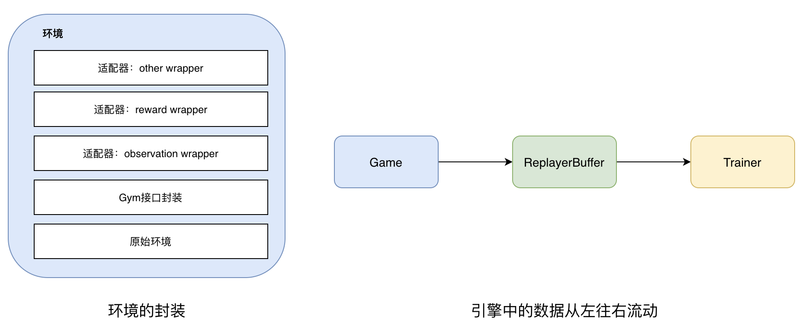

# 环境的添加、自定义和使用

引擎的环境封装遵循[Gym](https://gym.openai.com/)的接口规范，首先使用Gym规范对原始环境进行封装，然后使用适配器对原始环境进行自定义。适配器不能改变原始环境的内部状态，只能对原始环境返回的状态四元组（observation、reward、done、info）进行二次加工和对环境要接受的 action 进行预处理。

**适配器的作用**：

-   对环境返回的原始信息进行二次加工，

    -   定制reward，observation等。
    -   根据四元组信息计算另外的需要收集的单步状态信息，保存到 info 字典中
    -   定义和保存另外的游戏运行需要的游戏状态信息，保存在适配器类中。
    
-   对博弈过程进行统一规范，适配MALIB引擎

    -   使环境适配引擎对博弈的抽象格式 game、agent、player、env。

        除了Gym的接口，环境还需要在博弈的抽象上对引擎进行适配。引擎对博弈抽象时，每个环境中有固定的player，每个player有固定的id，每个agent有固定的id，这个需要首先通过适配器直接定义在环境中。

    -   对动作进行预处理

        原始环境接受的动作类型是固定的格式，引擎中对动作进行了统一的格式规定，原始环境和引擎中的player进行交互时，可使用动作适配器对动作进行转化。

    -   对数据按照player id和agent id进行整理。

-   数据预处理：数据预处理很灵活，可以在任何操作数据的地方进行，例如game中、replayerbuffer中、trainer中等。预处理后的数据少量时，**推荐使用环境适配器对原始数据进行预处理**，在replayerbuffer中处理数据时，是在一个进程中对大量数据进行集中处理，串行效率低。在环境适配器处理数据时，多个Game中并行对各自的四元组数据进行处理，并行效率高。当预处理后的数据较多时，需权衡对带宽的影响。如下图右边所示：除了四元组数据以外的其它数据，数据越小，预处理应越放在左边，数据越大，预处理应越放在右边。



## 环境封装步骤

### 1 对原始环境进行封装

任何接口风格的环境，要想接入引擎，首先需要把环境按照Gym接口规范进行封装

-   状态规范：环境应维护以下变量：
    -    action space：静态变量，动作空间
    -   observation space：静态变量，观测空间
    -    valid action ：动态变量，候选动作（可选）
    -   reward range
-   接口规范：环境应实现以下方法：
    -   reset()
    -   step()
    -   render()
    -   close()
    -   seed()
    -   sample_action()：（可选）

**提示**：

-   当原始环境需要用参数进行初始化时，对原始环境的封装应继续暴露这些参数，确保封装后的环境可设置参数。
-   引擎目前只支持在```aienv/env```模块下进行环境的添加以及在```aienv/wrapper```下进行适配器的添加。后期会支持在用户的工作目录定义和添加环境以及适配器。

### 2 编写适配器对环境进行定制

**适配器设计规范**：

-   适配器应单一。一个适配器只实现一个单一的功能。多种操作应使用多个适配器去实现。
-   适配器可堆叠。多个单一功能的适配器通过堆叠实现复杂的功能。
-   适配器的顺序。适配器处理的对象不同时，适配器的堆叠是无序的。适配器处理的对象相同时，适配器的堆叠是有序的。


自定义的环境适配器需要继承引擎中的BaseWrapper类，BaseWrapper中实现了一些通用的操作。通过继承机制避免重复代码。要对观察进行定制时，适配器可继承ObservationWrapper类，子类中只需实现observation方法即可。Reward、Action也类似。

```python
class BaseWrapper(BaseEnv):
    def __init__(self, env):
        self.env = env
        self.observation_space = self.env.observation_space
        self.action_space = self.env.action_space

    def step(self, action):
        return self.env.step(action)

    def reset(self):
        return self.env.reset()

    def render(self):
        return self.env.render()


class ObservationWrapper(BaseWrapper):
    def reset(self):
        obs = self.env.reset()
        return self.observation(obs)

    def step(self, action):
        obs, r, done, info = self.env.step(action)
        return self.observation(obs), r, done, info

    def observation(self, obs):
        return obs


class RewardWrapper(BaseWrapper):
    def reset(self):
        obs = self.env.reset()
        return self.observation(obs)

    def step(self, action):
        obs, r, done, info = self.env.step(action)
        return obs, self.reward(r), done, info

    def reward(self, obs):
        return obs


class ActionWrapper(BaseWrapper):
    def step(self, action):
        action = self.action(action)
        o, r, d, i = self.env.step(action)
        return o, r, d, i

    def action(self, action):
        return action

```

以 CartPole-v0 为例，需要定制观察时，实现以下一个适配器

```python
class ObsWrapper(ObservationWrapper):
    def __init__(self, env):
        super().__init__(env)
        self.game_roles = ["p0"]

    def observation(self, obs):
        obss = {}
        for role_name in self.game_roles:
            obss[role_name] = obs
        return obss

```


### 3 在引擎中注册自己的环境

引擎提供register接口实现对环境的注册。用户需要在```aienv/__init__.py```中注册自己的环境。以 CartPole v0 和 GFootball 为例，注册的代码为：

```python
register(
    id="cartpole_v0",
    params={
        "raw_env": "gym:CartPole_V0",
        "wrapper": [
            "gym:ObsWrapper",
            "gym:AWrapper",
            "gym:FrameLimitWrapper",
        ],
    },
)

register(
    id="gfootball_11v11_easy_stochastic",
    params={
        "raw_env": "gfootball:GFootBall",
        "env_params": {"env_name": "11_vs_11_easy_stochastic"},
    },
)
```

id 表示该环境全局唯一的名字， raw_env 设置用gym封装的原始环境的类名，wrapper 设置要用到的适配器。 env_params 设置原始环境的初始化参数。 wrapper 和 env_params 是可选的。

### 4 获取自己的环境

malib模块提供```makeenv(env_id)```接口，通过环境的注册 id 获取环境的实例对象。


