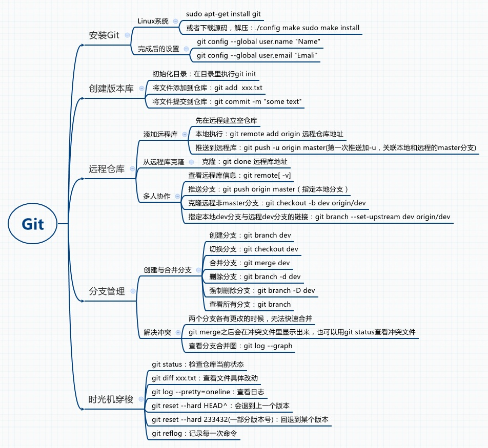

# wargame Git工作流程_V1

参考链接：[Git工作流程](http://www.ruanyifeng.com/blog/2015/12/git-workflow.html)

## Github workflow

1. #### 目标
    项目主分支main更新太频繁，会导致代码不稳定，bug累积等，影响算法开发和训练以及测试的效率。目前需要使用一种git 工作流来规范代码的更新和迭代。Github flow是较为简单的Git 工作流，适合维护持续开发的项目。因此采用Github flow作为项目的工作流。
    使用Github workflow工作流后，能减小代码更新和维护的成本，提高协作效率。期望的效果为：
    1. 主分支永远处于最新的稳定和可用状态。
    2. 任何功能的添加和代码的更新都发生在其它本地临时分支上
    3. 主分支代码的更新只包含两种情况：
       - 从其它分支合并过来经过测试的可用的更新
       - 修复bug、调整参数
    4. 主分支以tag的形式保存历史版本，不同版本之间可随时快速切换

2. #### 工作流：Github flow
    Github flow的官方流程如下图：
    

    ##### 进一步精简后的工作流(去掉了 github flow 中的 pull request)
    1. 小修小补：当需要更新极少的代码，解决bug等，可直接本地调试后推送到主分支。
    2. 功能的增加，代码的改进：这种情况一般按照以下步骤进行：
        - 第一步：从本地master拉出新的本地临时分支，名字不和已存在的分支冲突
        - 第二步：在新分支上进行功能的开发和测试
        - 第三步：把新分支合并进本地master，删除临时分支
        - 第四步：把本地master的更新同步到远程仓库
  
3. #### 代码的提交
    1. master的修改应及时推送到远程仓库
    2. 远程master的更新及时同步到本地
    2. 临时分支的创建、修改和删除应只在本地进行
    3. 远程仓库一般情况下只提交master的更新

4. #### 项目版本管理
    - 版本号命名
       1. 命名格式：主版本号.子版本号.修正版本号
       2. 主版本号：代码改动较大，更改后的代码无法合并到原来代码，例如彻底重写某个模块，即无法向后兼容
       3. 子版本号：代码的增量更新，增加了新功能，或优化了某个模块，向后兼容
       4. 修正版本号：修复bug或优化代码
       5. 例如：1.0，1.2.3
5. #### 项目分支管理
    一般情况下用tag在master分支上管理代码的迭代
    以下情况创建新的分支进行管理
      - 当框架或算法进行重大的更新，彻底无法向后兼容
      - 更换新的框架或算法
      - 更换新的地图或环境

    为了方便代码的训练和调试，本地可以自由建立一些分支，这些分支只用于本地代码的调试、训练、测试
#### git常用命令

